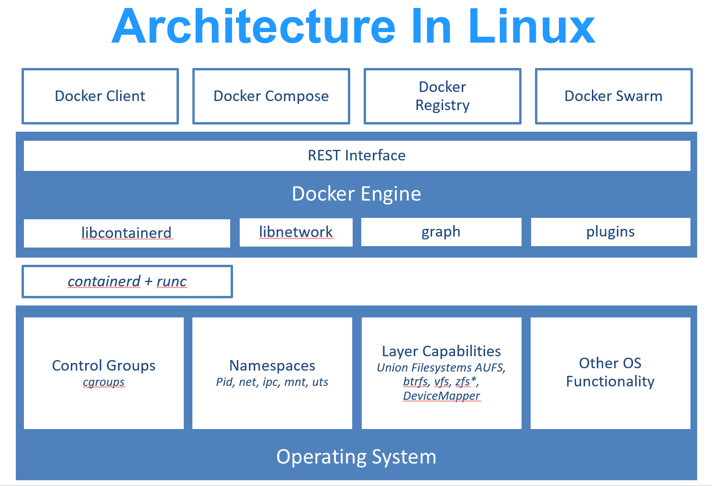

# Docker CE

Docker 的 community edition 版本，现在使用比较多的 container 管理工具，其他还有 `containerd`, `rkt`,`cri-o` 等等。

## Docker 的架构

* **dockerd:**  接收 Docker API 请求并管理 Docker 资源对象，如镜像，容器，网络和存储。
* **docker:**   客户端工具，调用 docker api  对资源对象进行管理。
* **registry:**  docker 的镜像存储的仓库。

## Docker 的资源对象

* **image:**  通过 Dockerfile 生成的镜像，相当于程序的运行环境和程序打包在一起。
* **container:** 是通过 image 创建的运行的实例，通过 dockerd 创建的一个或多个子进程。

## Docker 架构图

